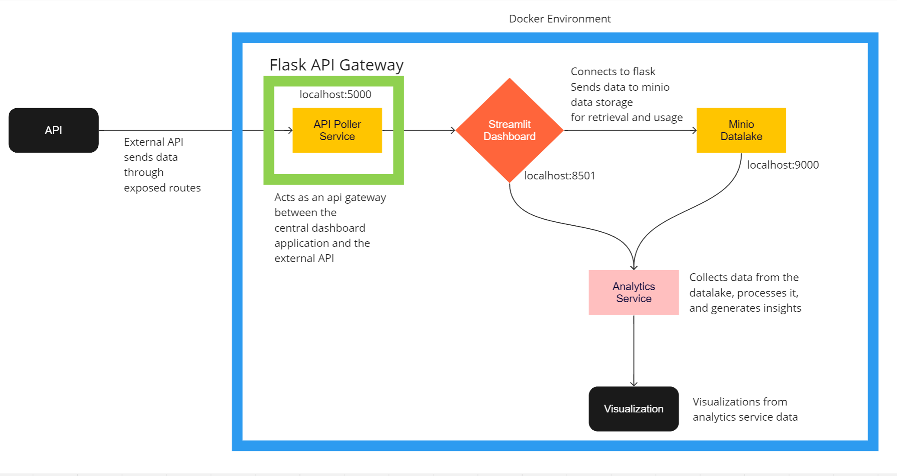

# Webjet API Test - Code Repository

Task:

A sample API has been created that provides access to a mocked movies database.

There are 2 API operations available for 2 popular movie databases, cinemaworld and filmworld

    * `/api/{cinemaworld or filmworld}/movies` : This returns the movies that are available

    * `/api/{cinemaworld or filmworld}/movie/{ID}`: This returns the details of a single movie

To access this API you'll require an API token provided below.

Exercise: 

1. Build an app that polls for prices 7 times, thus simulating prices over a period of time.
2. The API is designed to be flaky so you may not get prices back, or the API may hang.  
3. Assume no response as no price and move on
4. Compute the movie provider who is the cheapest overall.
5. Compute the movie that is the cheapest overall.
6. The goal of the test is to allow you to present your best code that you feel proud off.
7. Feel free to make and document any assumptions you have made.
8. The API token provided to you should not be exposed to the public.

### System Architecture

