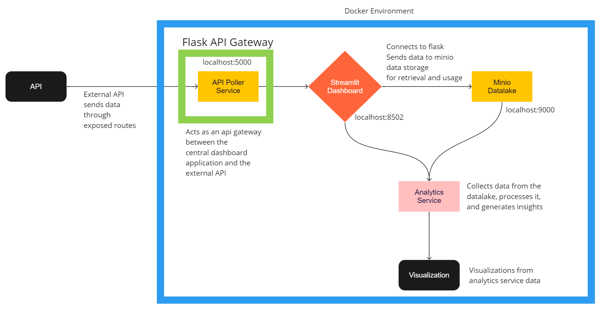

# Webjet API Test - Code Repository

### Key Assumptions:
1. I do not know the business context behind the term - "Movie Provider"; As such I have assumed that to mean the Director of the movie, as they are the primary ones responsible for providing the movie
2. I do not know the business context behind the 2 databases. I have seen that Episode 7 (Force Awakens) does not exist in one of the databases. This could mean multiple things, however I have assumed that particular database to be older (since Episode 7 came out much later than the other movies) and not having the most updated data.
3. I do not know the business context behind the `Price` variable. They do not reflect any real world amount that I did a bit of Googling into, and I can only assume them to be arbitrary, but idempotent (as it seems from the multiple API calls) values.
4. Since I have assumed no real relation between the 2 databases, I have given the user the freedom to choose which database they want to check movie prices in. I have also given them the option to compare the cheapest movie from `cinemaworld` against the cheapest movie from `filmworld` if they so choose. That would technically be the cheapest movie overall.
5. Similarly for the director as well.  

`Please make sure that ports 5000, 8502, 9000 and 9001 are free on your system for the application to run.`

In order to run the application please use the following docker commands:

`docker compose build`
`docker compose up -d`

There are 3 components to this application:

* Frontend Streamlist Dashboard
* Backend Flask API Gateway
* Minio Data Storage

Once you start up the services through `docker-compose` they should spin up and be available to use.

### Streamlit Dashboard

The central application itself is a streamlit dashboard. This is available at `localhost:8501`

There are 2 databases - `Cinemaworld` and `Filmword` that we can connect to via the dashboard. 

I have included a toggle there, so that the user can switch between the 2 databases at any time.

Upon toggling a database, the following workflow takes place:

1. Fetches all movie data, and stores it in the datalake
2. Shows a preview of the stored data
3. Next, iterates over all the movies and fetches their data
4. Stores each movie's data as a separate file, in its respective directory within the datalake
5. Computes cheapest movie and director

### System Architecture

